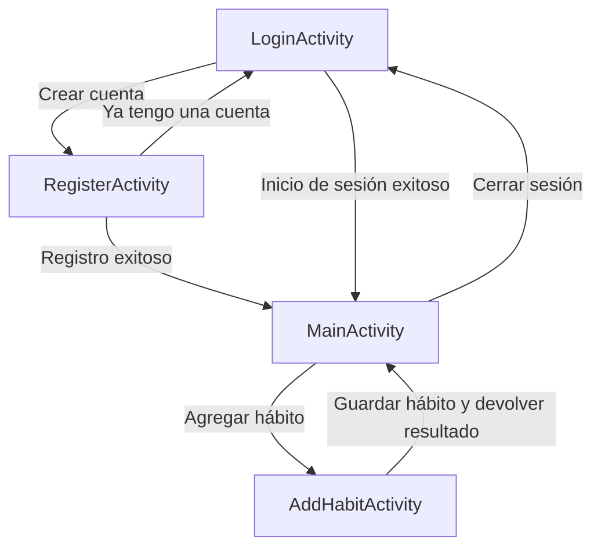

# Mis hábitos

## Descripción general

**Mis hábitos** es una aplicación móvil desarrollada en Android que permite registrar y administrar hábitos personales.

La aplicación utiliza **Firebase Authentication** para el registro e inicio de sesión de usuarios y **Cloud Firestore** para almacenar los datos de cada cuenta.

Cada usuario puede consultar y administrar únicamente sus propios hábitos.

---

## Objetivo de la aplicación

El objetivo de la aplicación es brindar una herramienta sencilla para organizar hábitos personales.

El usuario puede:

- Crear una cuenta.
- Iniciar y cerrar sesión.
- Visualizar su nombre.
- Agregar hábitos.
- Consultar sus hábitos almacenados.
- Marcar hábitos como completados o pendientes.
- Eliminar un hábito individual.
- Eliminar todos sus hábitos.

Los datos permanecen almacenados en Cloud Firestore después de cerrar o reiniciar la aplicación.

---

## Funcionalidades principales

La aplicación permite:

- Crear una cuenta con nombre, correo electrónico y contraseña.
- Iniciar sesión con correo electrónico y contraseña.
- Mostrar el nombre del usuario autenticado.
- Cerrar la sesión actual.
- Agregar nuevos hábitos.
- Consultar los hábitos almacenados.
- Marcar un hábito como completado o pendiente.
- Eliminar un hábito individual.
- Eliminar todos los hábitos del usuario.
- Mostrar la cantidad total de hábitos.
- Mostrar un mensaje cuando la lista está vacía.
- Guardar los datos en Cloud Firestore.
- Separar los hábitos según el usuario autenticado.
- Actualizar la lista automáticamente mediante un listener de Firestore.
- Enviar datos entre Activities utilizando `Intent` y `putExtra`.
- Notificar operaciones mediante mensajes `Toast`.

---

## Pantallas implementadas

### Pantalla de inicio de sesión

La pantalla `LoginActivity` permite ingresar a una cuenta existente.

Elementos principales:

- Campo de correo electrónico.
- Campo de contraseña.
- Botón **Iniciar sesión**.
- Botón **Crear cuenta**.
- Validación de campos obligatorios.
- Mensajes de éxito o error mediante `Toast`.

Flujo de uso:

1. El usuario ingresa su correo electrónico.
2. El usuario ingresa su contraseña.
3. Presiona **Iniciar sesión**.
4. Firebase Authentication valida las credenciales.
5. Si los datos son correctos, se abre la pantalla principal.
6. Si ocurre un error, se muestra un mensaje al usuario.

---

### Pantalla de registro

La pantalla `RegisterActivity` permite crear una nueva cuenta.

Elementos principales:

- Campo de nombre.
- Campo de correo electrónico.
- Campo de contraseña.
- Campo para confirmar la contraseña.
- Botón **Registrarse**.
- Botón **Ya tengo una cuenta**.

Validaciones implementadas:

- Todos los campos son obligatorios.
- Las contraseñas deben coincidir.
- La contraseña debe tener al menos seis caracteres.

Flujo de registro:

1. El usuario completa sus datos.
2. Firebase Authentication crea la cuenta.
3. Cloud Firestore guarda un documento en la colección `usuarios`.
4. El usuario accede a la pantalla principal.

---

### Pantalla principal

La pantalla `MainActivity` muestra la información y los hábitos del usuario autenticado.

Elementos principales:

- Título **Mis hábitos**.
- Saludo personalizado con el nombre del usuario.
- Imagen representativa.
- Botón **Agregar hábito**.
- Botón **Limpiar lista**.
- Botón **Cerrar sesión**.
- Contador total de hábitos.
- Lista dinámica de hábitos.
- Mensaje para indicar que la lista está vacía.

La pantalla consulta únicamente los hábitos del usuario autenticado.

La lista se actualiza automáticamente cuando cambia la información almacenada en Cloud Firestore.

Interacciones disponibles:

- Presionar un hábito para cambiar su estado.
- Mantener presionado un hábito para eliminarlo.
- Presionar **Agregar hábito** para abrir la pantalla de carga.
- Presionar **Limpiar lista** para eliminar todos los hábitos.
- Presionar **Cerrar sesión** para volver a la pantalla de acceso.

---

### Pantalla para agregar hábitos

La pantalla `AddHabitActivity` permite registrar un hábito nuevo.

Elementos principales:

- Título **Agregar hábito**.
- Descripción de la funcionalidad.
- Campo de texto para escribir el hábito.
- Botón **Guardar hábito**.
- Validación para impedir el registro de hábitos vacíos.

Flujo de uso:

1. El usuario escribe el nombre del hábito.
2. Presiona **Guardar hábito**.
3. Se crea un documento en la colección `habitos`.
4. La Activity devuelve el nombre del hábito a `MainActivity`.
5. La pantalla principal muestra un `Toast` confirmando el guardado.
6. El listener de Firestore actualiza la lista.

---

## Flujo de navegación



---

## Pasaje de datos entre Activities

La aplicación implementa el envío de datos entre Activities.

Desde `MainActivity` se abre `AddHabitActivity` mediante un `ActivityResultLauncher`.

Después de guardar un hábito, `AddHabitActivity` crea un `Intent` de resultado y agrega el nombre mediante:

```java
resultado.putExtra(
        EXTRA_HABITO_CREADO,
        textoHabito
);
```

`MainActivity` recibe el resultado y obtiene el dato mediante:

```java
String nombreHabito = datos.getStringExtra(
        AddHabitActivity.EXTRA_HABITO_CREADO
);
```

El nombre recibido se utiliza para mostrar una notificación:

```text
Hábito guardado: nombre del hábito
```

---

## Administración de hábitos

### Crear un hábito

El usuario escribe el nombre del hábito y presiona **Guardar hábito**.

El documento almacenado contiene:

- Nombre del hábito.
- UID del usuario propietario.
- Estado de finalización.
- Fecha de creación.

---

### Consultar hábitos

La pantalla principal consulta únicamente los documentos cuyo campo `usuarioId` coincide con el UID del usuario autenticado.

Los hábitos se muestran ordenados según su fecha de creación.

---

### Cambiar el estado

Al presionar brevemente un hábito, su estado cambia entre:

- Pendiente.
- Completado.

Los hábitos completados aparecen tachados y con menor opacidad.

El nuevo estado se guarda en Cloud Firestore.

---

### Eliminar un hábito

Al mantener presionado un hábito, aparece un cuadro de confirmación.

El usuario puede:

- Cancelar la operación.
- Eliminar definitivamente el hábito.

---

### Eliminar todos los hábitos

El botón **Limpiar lista** muestra una confirmación antes de eliminar todos los hábitos del usuario.

La eliminación se realiza mediante una operación por lote de Firestore.

---

## Autenticación

La aplicación utiliza Firebase Authentication con el proveedor:

- Correo electrónico y contraseña.

Cuando el usuario inicia sesión correctamente, se abre `MainActivity`.

En `MainActivity` se comprueba que exista un usuario autenticado. Si no existe una sesión válida, la aplicación redirige a `LoginActivity`.

Cuando el usuario cierra sesión:

1. Se muestra un cuadro de confirmación.
2. Se ejecuta `FirebaseAuth.signOut()`.
3. Se limpia la pila de Activities.
4. Se vuelve a la pantalla de inicio de sesión.

---

## Base de datos

La aplicación utiliza Cloud Firestore.

### Colección `usuarios`

Cada documento utiliza como identificador el UID generado por Firebase Authentication.

Campos principales:

- `nombre`
- `email`
- `creadoEn`

Ejemplo:

```text
usuarios/
└── UID_DEL_USUARIO/
    ├── nombre
    ├── email
    └── creadoEn
```

---

### Colección `habitos`

Cada documento representa un hábito.

Campos principales:

- `nombre`
- `usuarioId`
- `completado`
- `creadoEn`

Ejemplo:

```text
habitos/
└── ID_DEL_HABITO/
    ├── nombre
    ├── usuarioId
    ├── completado
    └── creadoEn
```

El campo `usuarioId` permite relacionar cada hábito con su propietario.

---

## Operaciones implementadas en Firestore

La aplicación implementa operaciones CRUD:

- **Create:** creación de usuarios y hábitos.
- **Read:** consulta del usuario y sus hábitos.
- **Update:** modificación del estado `completado`.
- **Delete:** eliminación individual o completa de hábitos.

---

## Seguridad de los datos

Las reglas de Cloud Firestore verifican que el usuario esté autenticado.

Cada usuario puede acceder únicamente:

- A su propio documento dentro de `usuarios`.
- A los hábitos cuyo campo `usuarioId` coincide con su UID.

Las reglas verifican el propietario durante las operaciones de creación, lectura, actualización y eliminación.

De esta forma, los datos de diferentes usuarios permanecen separados.

---

## Notificaciones al usuario

La aplicación utiliza mensajes `Toast` para informar:

- Inicio de sesión exitoso.
- Error de inicio de sesión.
- Registro exitoso.
- Error de registro.
- Hábito guardado correctamente.
- Errores al cargar o modificar datos.
- Resultado de la eliminación de hábitos.

También se utilizan cuadros `AlertDialog` para confirmar:

- Eliminación de un hábito.
- Eliminación de todos los hábitos.
- Cierre de sesión.

---

## Componentes de Android utilizados

- `ConstraintLayout`
- `LinearLayout` vertical
- `LinearLayout` horizontal
- `ScrollView`
- `TextView`
- `ImageView`
- `Button`
- `EditText`
- `Toast`
- `AlertDialog`
- `Intent`
- `ActivityResultLauncher`

---

## Recursos utilizados

Los recursos de la aplicación se encuentran organizados en archivos XML.

### Textos

Los textos reutilizables se encuentran en:

```text
res/values/strings.xml
```

### Dimensiones

Los márgenes, tamaños y separaciones se encuentran en:

```text
res/values/dimens.xml
```

### Colores

Los colores utilizados por las pantallas se encuentran en:

```text
res/values/colors.xml
```

### Interfaces

Las interfaces se encuentran en:

```text
res/layout/
```

---

## Tecnologías utilizadas

- Java.
- Android Studio.
- Android SDK.
- Firebase Authentication.
- Cloud Firestore.
- Firebase Android SDK.
- Gradle.
- XML.
- Git.
- GitHub.

---

## Clases principales

### `LoginActivity`

Administra el inicio de sesión y la navegación hacia el registro.

### `RegisterActivity`

Administra la creación de usuarios y el almacenamiento de sus datos.

### `MainActivity`

Consulta y muestra los hábitos del usuario. También administra su actualización y eliminación.

### `AddHabitActivity`

Permite crear hábitos y devolver el resultado a la pantalla principal.

### `Habit`

Representa el modelo de datos utilizado por Cloud Firestore.

---

## Organización principal del proyecto

```text
app/
├── google-services.json
└── src/main/
    ├── AndroidManifest.xml
    ├── java/com/example/myapplication/
    │   ├── AddHabitActivity.java
    │   ├── Habit.java
    │   ├── LoginActivity.java
    │   ├── MainActivity.java
    │   └── RegisterActivity.java
    └── res/
        ├── drawable/
        ├── layout/
        │   ├── activity_add_habit.xml
        │   ├── activity_login.xml
        │   ├── activity_main.xml
        │   └── activity_register.xml
        ├── mipmap/
        ├── values/
        │   ├── colors.xml
        │   ├── dimens.xml
        │   ├── strings.xml
        │   └── themes.xml
        └── xml/
```

---

## Requisitos para ejecutar el proyecto

- Android Studio.
- Conexión a Internet.
- Android SDK configurado.
- Emulador o dispositivo Android.
- Proyecto Firebase configurado.
- Archivo `google-services.json` dentro de la carpeta `app`.

---

## Ejecución del proyecto

1. Abrir el proyecto en Android Studio.
2. Esperar a que finalice la sincronización de Gradle.
3. Seleccionar un emulador o dispositivo.
4. Ejecutar la configuración `app`.
5. Crear una cuenta o iniciar sesión.
6. Utilizar las opciones disponibles en la pantalla principal.

No es necesario iniciar un servidor local, ya que Firebase funciona como servicio externo.

---

## Pruebas realizadas

Se comprobaron los siguientes casos:

- Registro de un usuario nuevo.
- Inicio de sesión con una cuenta existente.
- Visualización del nombre del usuario.
- Creación de hábitos.
- Recepción del hábito mediante `Intent Extra`.
- Actualización automática de la lista.
- Cambio de estado de un hábito.
- Eliminación individual.
- Eliminación completa.
- Confirmación antes de operaciones destructivas.
- Cierre de sesión.
- Separación de datos entre usuarios.
- Persistencia de datos en Cloud Firestore.
- Funcionamiento de las reglas de seguridad.

---

## Control de versiones

El proyecto utiliza Git y GitHub.

Los cambios se organizaron mediante commits separados siguiendo una convención similar a Conventional Commits.

Ejemplos:

```text
feat: configure Firebase Auth and Firestore
feat: implement Firebase authentication and user registration
feat: implement Firestore habit CRUD
feat: display current user name from Firestore
feat: implement user logout
feat: pass created habit between activities
docs: update README with Firebase functionality
```

---

## Repositorio

El proyecto se encuentra disponible en:

```text
https://github.com/Valarich/final-am-acn4a-annamuradov
```

---

## Autor

**Murad Annamuradov**

Materia: **Aplicaciones Móviles**

Comisión: **ACN4A**

Profesor: **Sergio Medina**